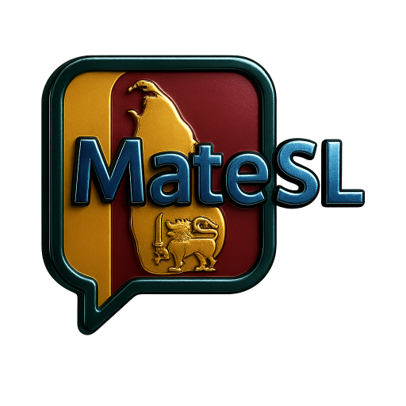
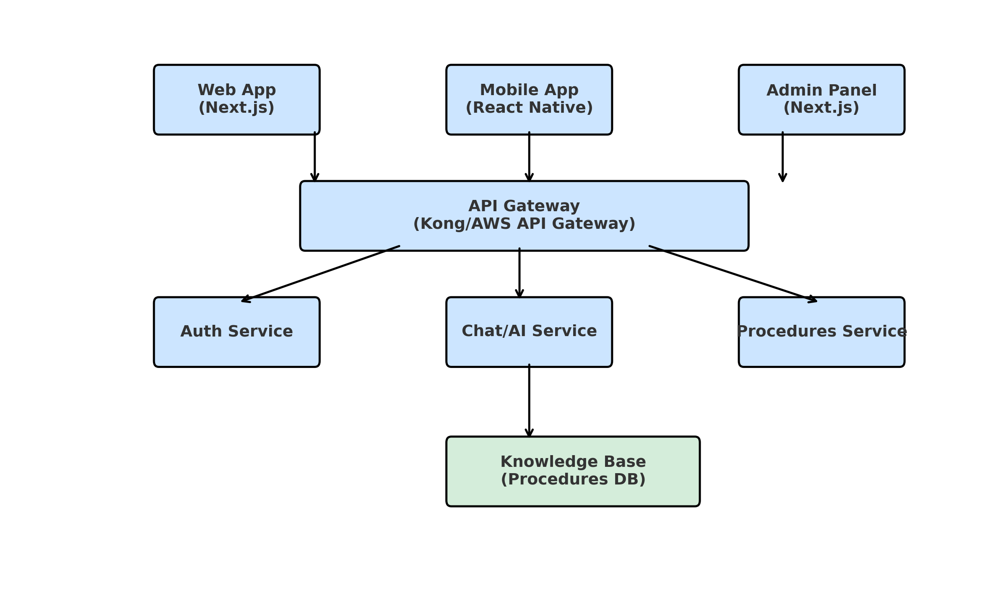

# MateSL System



> **AI-powered platform to guide Sri Lankan citizens through government procedures.**  
> Web, mobile, and backend services in a scalable monorepo, with real-time AI-assisted chat, multi-language support, and a dynamic knowledge base.

---

## 📜 Overview

**MateSL** is an AI-driven platform designed to help Sri Lankan citizens navigate complex common procedures such as obtaining birth certificates, applying for passports, and updating NICs. MateSL provides **instant, accurate, and up-to-date instructions** — without requiring users to watch hours of unrelated content or search endlessly online.

### Key Features

- **AI Chat Interface**: Get step-by-step guidance on public procedures in Sinhala, Tamil, or English.
- **Dynamic Knowledge Base**: Admins can update procedures anytime — no model retraining required.
- **Multi-Platform Support**: Web, mobile, and admin panel for content managers.
- **Login Optional**: Use anonymously, or log in (Google Auth / email) to save chats for 3 months.
- **Multi-Language**: Sinhala 🇱🇰, Tamil 🇱🇰, and English.
- **Offline Mobile Mode**: Mobile app works even with poor connectivity.

---

## 🏗 Architecture

**Core Pattern**: Microservices + Event-Driven Communication



---

## ⚙️ Tech Stack

| Layer              | Technology Choices                                                                                   |
| ------------------ | ---------------------------------------------------------------------------------------------------- |
| **Frontend (Web)** | Next.js 14 (App Router), TypeScript, Tailwind CSS, React Query, Framer Motion, Zod, React Hook Form  |
| **Mobile App**     | React Native (Expo), React Navigation, React Query, AsyncStorage                                     |
| **Backend**        | Node.js (Fastify), TypeScript, Prisma ORM, PostgreSQL, Redis, Bull Queue, Passport.js (Google OAuth) |
| **AI Services**    | OpenAI GPT-4, Hugging Face Transformers, Pinecone/Qdrant (vector DB)                                 |
| **Knowledge Base** | Headless CMS (Strapi/Contentful), Elasticsearch, version control for procedures                      |
| **Infrastructure** | Docker, Kubernetes, Terraform, AWS/GCP, Cloudflare/CloudFront CDN, GitHub Actions CI/CD              |

---

## 📂 Monorepo Structure

```
matesl-system/
├── docs/                  # Documentation & assets
├── packages/
│   ├── admin/             # Admin panel (Next.js)
│   ├── ai-service/        # AI/ML processing microservice
│   ├── api/               # Main API service
│   ├── auth-service/      # Authentication microservice
│   ├── database/          # Prisma schema & migrations
│   ├── mobile/            # React Native mobile app
│   ├── procedures-service # Procedures management microservice
│   ├── shared/            # Shared constants, types, and utilities
│   ├── web/               # Next.js web application
├── scripts/               # Build & deployment scripts
└── README.md
```

---

## 🚀 Development Plan (High-Level)

| Phase                       | Duration  | Key Deliverables                                      |
| --------------------------- | --------- | ----------------------------------------------------- |
| **Phase 1**: Foundation     | 1–4 wks   | Project setup, Docker, CI/CD, DB schema               |
| **Phase 2**: Core Backend   | 5–8 wks   | Auth service, CRUD for procedures, versioning, search |
| **Phase 3**: Knowledge Base | 9–12 wks  | Admin panel, content management, AI integration       |
| **Phase 4**: Web Frontend   | 13–16 wks | Responsive UI, chat, search, SEO, PWA                 |
| **Phase 5**: Mobile App     | 17–20 wks | Cross-platform app, offline mode, push notifications  |
| **Phase 6**: QA & Launch    | 21–24 wks | Testing, security audits, production deployment       |

---

## 🔒 Security Features

- **Authentication**: JWT + Refresh Tokens, Google OAuth
- **Authorization**: Role-based access control
- **Data Protection**: End-to-end encryption for sensitive data
- **DDoS Protection**: Rate limiting, WAF
- **Compliance**: GDPR-like data handling

---

## 📊 Performance Optimizations

- Multi-layer caching (memory, Redis, CDN)
- Database indexing & query optimization
- AI response caching
- Static asset optimization

---

## 🛠 Setup Instructions

### 1️⃣ Prerequisites

- Node.js ≥ 18
- Docker & Docker Compose
- PostgreSQL
- Redis
- Git

### 2️⃣ Clone and Install

```bash
git clone git@github.com:RizenicLabs/matesl-system.git
cd matesl-system
npm install --workspaces
```

### 3️⃣ Run in Development

```bash
docker-compose -f docker-compose.dev.yml up --build
```

---

## 👥 Contributing

1. Fork the repo
2. Create a new branch:
   ```bash
   git checkout -b feature/my-feature
   ```
3. Commit changes:
   ```bash
   git commit -m "Add my feature"
   ```
4. Push branch & create PR

---

## 📄 License

This project is licensed under the **MIT License** — see [LICENSE](LICENSE) for details.

---

## 🌐 Links

- **Organization**: [RizenicLabs](https://github.com/RizenicLabs)
- **Issues**: [GitHub Issues](https://github.com/RizenicLabs/matesl-system/issues)
- **Discussions**: _Coming soon_
